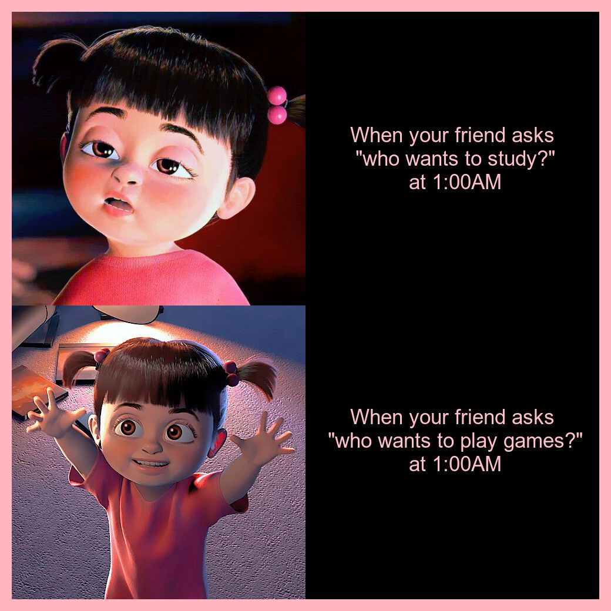

# The meme


### R Code used to create the meme
```{r}
library(magick)

#Reading image for meme
tired_image<- image_read(path="https://i.pinimg.com/474x/eb/68/97/eb68977fc13003971e885e4163f6f226.jpg") %>%
  image_scale(500)

happy_image<- image_read(path="https://64.media.tumblr.com/8466b309444d637db821b181b2e258af/1a332bd0df30b373-c1/s500x750/190c67f508c3af2e1f133a36e3fcd31b36c2d145.png") %>%
  image_scale(500)

#Texts for the meme
tired_text<- image_blank(width = 500, height=500, color="black")%>%
  image_annotate(text='When your friend asks\n "who wants to study?"\n at 1:00AM', color="pink", font="Arial", size=35, gravity = "center")

happy_text<- image_blank(width = 500, height=500, color="black")%>%
  image_annotate(text='When your friend asks\n "who wants to play games?"\n at 1:00AM
                 ', color="pink", font="Arial", size=35, gravity = "center")

#Creating the meme
row1<- image_append(c(tired_image, tired_text))
row2<- image_append(c(happy_image, happy_text))

boo_meme <-c(row1, row2) %>%
  image_append(stack=TRUE) %>% image_border("lightpink", "20x20")

image_write(boo_meme, "boo_meme.png")
```
The functions from the magick package that were used to create the meme were
1. image_read()
2. image_scale()
3. image_blank()
4. image_annotate()
5. image_append()
6. image_border()
7. image_write()

### Where did the idea for the meme come from?
The motivation behind this meme is something that happens often to me. My friends are awake in a discord call at around 1:00AM studying together and asked if I wanted to study with them. 
I respond by telling them I was feeling too tired to study but as soon as they asked me to play valorant, 
I had become wide awake and was ready to play some games. 
The meme I have created is an adaption to an existing meme such as the Hotline Bling Drake meme where there are images showing different reactions to liking something more than the other.
